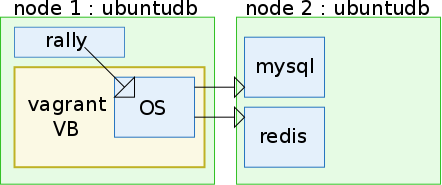

## OpenStack with remote databases on Grid'5000

### What it does

This script gets 2 nodes on one of rennes clusters on Grid'5000.

It deploys ubuntudb.tgz, which is the same as ubuntu.tgz ([cf ci-g5k Readme](https://github.com/Marie-Donnie/misc/tree/master/scripts/ci-g5k "ci-g5k")), but with a redis and mysql databases ready to be used.

Then, on the "main" node, it deploys my discovery-vagrant, with the necessary tweaking to connect to the other two nodes databases.



### What you need

You will need to get the kadeploy environnement file and the tarball in a envdb folder on the site where you will deploy (default Rennes).

You will also need docopt on the frontend that will launch the script.
```bash
pip install --user docopt
```

Finally, with `os-distri-db.py` on the frontend you wish to use, run the command :
```bash
python os-distri-db.py run --full
```


### More information
```
Usage:
    testresa.py reservation [--site <city>]
    testresa.py reservation [--duration <time>]
    testresa.py reservation [--nodes <nb>]
    testresa.py reservation --only
    testresa.py run [(--job_id <id> --job_site <city>)(--full | -i <impl>)]
    testresa.py (-h | --help)
    testresa.py --version

Options:
    -h --help          Show this screen
    --version          Show version
    --site <city>      Choose the site [default: rennes]
    --duration <time>  A duration, formatted hh:mm:ss, must be <= to [default: 03:00:00]
    --nodes <nb>       Number of nodes [default: 2]
    --full             Run tests for both implementation
    -i <impl>          Choose implementation 
    --job_id <id>      Specify the job id of an already created job
    --job_site <city>  Specify the job site of an already created job
```
